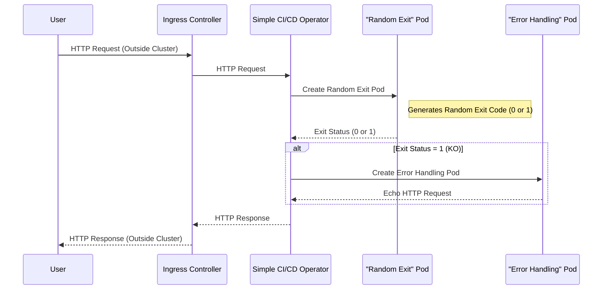

# Simple CI/CD Operator for Kubernetes


The Simple CI/CD operator for Kubernetes empowers users to create workflows triggered by webhooks, facilitating the orchestration of Kubernetes Jobs according to specific requirements.


## Table of Contents
1. [Getting Started](#getting-started)
2. [Description](#description)
3. [Contributing](#contributing)
4. [License](#license)


## Getting Started

### Installation by Manifest

To install Simple CI/CD directly from the internet, use the following command:

```sh
kubectl apply -k 'github.com/jlsalvador/simple-cicd/config/default?ref=stable'
```

If you have forked the Simple CI/CD repository and want to install it from your local copy, use the following command:

```sh
kubectl apply -k config/default
```


## Description

Simple CI/CD offers users the ability to trigger Kubernetes Jobs through webhooks, providing control over <ins>when</ins> and <ins>how</ins> multiple Jobs and their dependencies are executed.

### Features

- Easy to understand
- Uses standard Kubernetes resources
- No external cloud dependencies
- Low resource usage

### Custom Resource Definitions

- **Workflow**: Responsible for cloning Jobs and triggering subsequent Workflows based on the exit status of completed Jobs.
- **WorkflowWebhook**: Serves as the trigger for Workflows, allowing the Simple CI/CD operator to listen for HTTP requests on a path named as the WorkflowWebhook (`/namespace/name`).
- **WorkflowWebhookRequest**: Initiates WorkflowWebhooks.

### Example:

In this example, we demonstrate the Simple CI/CD system's functionality:

1. **Receive HTTP Request**: The Simple CI/CD operator receives an HTTP request.

2. **Create a Random Exit Pod**: A Kubernetes pod is created, which generates a random exit code (either 0 or 1) upon execution.

3. **Error Handling**: If the previous pod's exit status indicates a failure (1), the system initiates another pod that echoes the content of the original HTTP request.



```yaml
# Job that randomly exits with code 0 or 1 (OK or Error)
apiVersion: batch/v1
kind: Job
metadata:
  name: job-example-random-exit
spec:
  suspend: true # Required to be true to disallow Kubernetes to start this job when it will be created
  backoffLimit: 0 # If this Job fail do not try to run it again
  template:
    spec:
      containers:
        - name: random-exit
          image: bash
          command: ["sh", "-c", "exit $$(($RANDOM % 2))"] # Sometimes will fails
      restartPolicy: Never # Do not re-run the pod if something fails
---
# Job that echoes "ERROR"
apiVersion: batch/v1
kind: Job
metadata:
  name: job-example-error
  namespace: default # Job namespace. Optional
spec:
  suspend: true # Required to be true to disallow Kubernetes to start this job when it will be created
  template:
    spec:
      containers:
        - name: error
          image: bash
          command: ["echo", "ERROR"]
        - name: echo-request
          image: bash
          command:
            - cat # Simple CI/CD will mounts the next request payloads inside all Pods
            - /var/run/secrets/kubernetes.io/request/body
            - /var/run/secrets/kubernetes.io/request/headers
            - /var/run/secrets/kubernetes.io/request/host
            - /var/run/secrets/kubernetes.io/request/method
            - /var/run/secrets/kubernetes.io/request/url
      restartPolicy: Never # Do not re-run the pod if something fails
---
# Workflow that will clones the "job-example-error" Job
apiVersion: simple-cicd.jlsalvador.online/v1alpha1
kind: Workflow
metadata:
  name: workflow-example-some-failures
  namespace: default # Workflow namespace. Optional.
spec:
  jobsToBeCloned:
    - name: job-example-error # Job name that will cloned
      namespace: default # Job namespace. Optional.
---
# Workflow that will clones the "job-example-random-exit" Job and
# triggers the "workflow-example-some-failures" Workflow on any Job failure
apiVersion: simple-cicd.jlsalvador.online/v1alpha1
kind: Workflow
metadata:
  name: workflow-example
spec:
  jobsToBeCloned:
    - name: job-example-random-exit # Job name that will cloned
  next:
    - name: workflow-example-some-failures
      namespace: default # Workflow namespace. Optional.
      when: OnAnyFailure # Only run this Workflow if some of the jobsToBeCloned fails
---
# WorkflowWebhook set the simple-cicd operator to listen for requests on the path "$namespace/$name"
apiVersion: simple-cicd.jlsalvador.online/v1alpha1
kind: WorkflowWebhook
metadata:
  name: workflowwebhook-example
spec:
  workflows:
    - name: workflow-example # Workflow that will be initiated
---
# Optional, recommended for public requests.
# Secret for the next Ingress, recommended for preventing undesired requests.
apiVersion: v1
kind: Secret
metadata:
  name: basic-auth-example
  namespace: simple-cicd-system # Namespace where the ingress-example is deployed
type: Opaque
stringData:
  auth: |
    # user:pass
    user:$apr1$j.P.ucaS$hHtkMN19glS9.ffLns2Eh/
---
# Optional, allows external requests from the cluster.
# Public Ingress listening at http://example.org/default/workflowwebhook-example with basic authorization.
apiVersion: networking.k8s.io/v1
kind: Ingress
metadata:
  name: ingress-example
  namespace: simple-cicd-system # Namespace where the simple-cicd-controller-manager is deployed
  annotations:
    nginx.ingress.kubernetes.io/auth-type: basic
    nginx.ingress.kubernetes.io/auth-secret: basic-auth-example
spec:
  ingressClassName: nginx
  rules:
    - host: example.org
      http:
        paths:
          - path: /default/workflowwebhook-example # The WorkflowWebhook namespace/name
            pathType: Prefix
            backend:
              service:
                name: simple-cicd-controller-manager # The simple-cicd operator service name
                port:
                  name: http
```

```sh
# To trigger the WorkflowWebhook from outside the cluster:
curl -u user:pass http://example.org/default/workflowwebhook-sample

# To trigger the WorkflowWebhook from inside the cluster:
curl http://simple-cicd-controller-manager.simple-cicd-system:9000/default/workflowwebhook-sample
```

### Motivation

The motivation behind developing Simple CI/CD arises from the need for a tool that aligns with specific requirements, as outlined in the table below. Existing solutions either impose excessive requirements or fail to meet desired expectations. The primary objective is to launch Jobs within the Kubernetes environment using webhooks to control timing and execution, without the need for virtual machines, Docker-in-Docker configurations, external dependencies, or components external to the Kubernetes ecosystem.

<table>
  <caption>Disclaimer: Based in my personal opinion. Please, do your own investigations.</caption>
  <thead>
    <tr>
      <th>Alternative</th>
      <th>Advantages</th>
      <th>Disadvantages</th>
    </tr>
  </thead>
  <tbody>
    <tr>
      <td>
        <a href="https://github.com/features/actions">Github Actions</a>
      </td>
      <td>
        <ul>
          <li>De-facto CI/CD for public GIT repositories at <a href="https://github.com">Github</a>.</li>
        </ul>
      </td>
      <td>
        <ul>
          <li>Supported by <a href="https://microsoft.com">Microsoft</a>.</li>
          <li>Closed garden.</li>
          <li>Actions requires to be public publishing.</li>
          <li>Limited by a paywall.</li>
          <li>Not suitable for air-gap environments or private clusters.</li>
        </ul>
      </td>
    </tr>
    <tr>
      <td>
        <a href="https://www.jenkins.io">Jenkins</a>
      </td>
      <td>
        <ul>
          <li>Open-source.</li>
          <li>Supported by the community and company foundations.</li>
          <li>Stable and real-world tested.</li>
        </ul>
      </td>
      <td>
        <ul>
          <li>Resource hungry.</li>
          <li>Requires Groovy for advanced tasks.</li>
          <li>Requires addons for Kubernetes.</li>
          <li>Limited CLI support.</li>
        </ul>
      </td>
    </tr>
    <tr>
      <td>
        <a href="https://tekton.dev">Tekton</a>
      </td>
      <td>
        <ul>
          <li>Open-source.</li>
          <li>Supported by <a href="https://cd.foundation">CD Foundation</a>.</li>
        </ul>
      </td>
      <td>
        <ul>
          <li>Can not use more than one PersistentVolume on the same Pod.</li>
          <li>Deprecated tasks from Catalog because its new on-going API version.</li>
        </ul>
      </td>
    </tr>
    <tr>
      <td>
        <a href="https://drone.io">Drone</a>
      </td>
      <td>
        <ul>
          <li>Open-source.</li>
        </ul>
      </td>
      <td>
        <ul>
          <li>Supported by <a href="https://www.harness.io">Harness</a>.</li>
          <li>Limited community pull requests support. Personal example: <a href="https://github.com/harness/gitness/pull/3030">https://github.com/harness/gitness/pull/3030</a></li>
        </ul>
      </td>
    </tr>
    <tr>
      <td>
        <a href="https://woodpecker-ci.org">Woodpecker CI</a>
      </td>
      <td>
        <ul>
          <li>Open-source (community fork of Drone).</li>
          <li>Supported by the community.</li>
        </ul>
      </td>
      <td>
        <ul>
          <li>Forget about namespaced PersistentVolume for multiples tasks.</li>
          <li>Limited Kubernetes support.</li>
        </ul>
      </td>
    </tr>
    <tr>
      <td>
        <a href="https://gitea.com/gitea/act_runner">Gitea act_runner</a>
      </td>
      <td>
        <ul>
          <li>Community effort for on-premise Github Actions.</li>
        </ul>
      </td>
      <td>
        <ul>
          <li>Requires Virtual Machine-like setup, as Github Actions.</li>
          <li>Lacks Kubernetes integrations.</li>
        </ul>
      </td>
    </tr>
    <tr>
      <td>
        <a href="https://github.com/jlsalvador/simple-cicd">Simple CI/CD</a>
      </td>
      <td>
        <ul>
          <li>Open-source.</li>
          <li>Supported by the community.</li>
          <li>Simple.</li>
          <li>Kubernetes native component as an operator.</li>
          <li>Platform agnostic (cloud, on-premise, hybrid).</li>
          <li>Low resource usage (around 32Mb RAM).</li>
        </ul>
      </td>
      <td>
        <ul>
          <li>Experimental and not yet real-world tested.</li>
          <li>Maintained by a single individual.</li>
          <li>No web interface (yet).</li>
        </ul>
      </td>
    </tr>
  </tbody>
</table>


### Installation by Helm

Available soon.

```sh
helm repo add simple-cicd https://jlsalvador.github.io/simple-cicd
helm install simple-cicd simple-cicd/sinple-cicd
```


## Contributing

### Design rules

- Keep it Simple
- Be Explicit
- Embrace Minimalism

### How it works

This project aims to follow the Kubernetes [Operator pattern](https://kubernetes.io/docs/concepts/extend-kubernetes/operator/).

It uses [Controllers](https://kubernetes.io/docs/concepts/architecture/controller/),
which provide a reconcile function responsible for synchronizing resources until the desired state is reached on the cluster.

You’ll need a Kubernetes cluster to run against. You can use [KIND](https://sigs.k8s.io/kind) to get a local cluster for testing, or run against a remote cluster.
**Note:** Your controller will automatically use the current context in your kubeconfig file (i.e. whatever cluster `kubectl cluster-info` shows).

### Test It Out

1. Install the CRDs into your cluster:

```sh
make install
```

2. Run your controller (this will run in the foreground, so switch to a new terminal if you want to leave it running):

```sh
make run
```

**NOTE:** You can also run this in one step by running: `make install run`

### Running on the cluster

1. Build and push your image to the location specified by `IMG`:

```sh
make docker-build docker-push IMG=<some-registry>/simple-cicd:tag
```

2. Deploy the controller to the cluster with the image specified by `IMG`:

```sh
make deploy IMG=<some-registry>/simple-cicd:tag
```

### Uninstall CRDs

To delete the CRDs from the cluster:

```sh
make uninstall
```

### Undeploy controller

UnDeploy the controller from the cluster:

```sh
make undeploy
```

### Modifying the API definitions

If you are editing the API definitions, generate the manifests such as CRs or CRDs using:

```sh
make manifests
```

**NOTE:** Run `make --help` for more information on all potential `make` targets

More information can be found via the [Kubebuilder Documentation](https://book.kubebuilder.io/introduction.html)


## License

Copyright 2023 José Luis Salvador Rufo <salvador.joseluis@gmail.com>.

Licensed under the Apache License, Version 2.0 (the "License");
you may not use this file except in compliance with the License.
You may obtain a copy of the License at

    http://www.apache.org/licenses/LICENSE-2.0

Unless required by applicable law or agreed to in writing, software
distributed under the License is distributed on an "AS IS" BASIS,
WITHOUT WARRANTIES OR CONDITIONS OF ANY KIND, either express or implied.
See the License for the specific language governing permissions and
limitations under the License.
