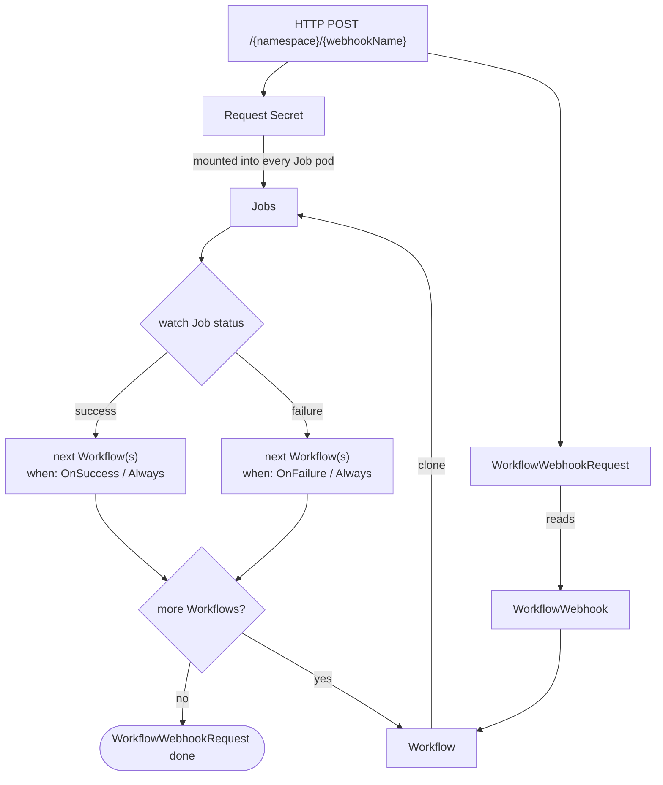
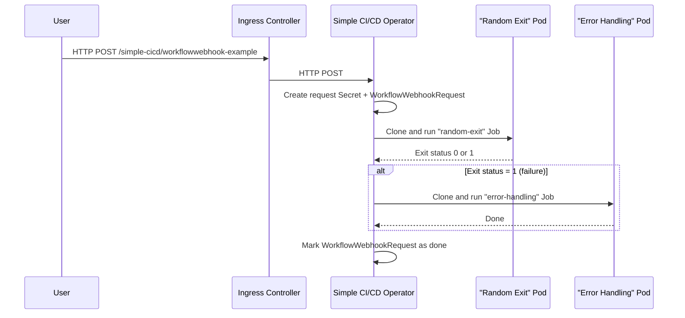

# Simple CI/CD


A lightweight Kubernetes-native CI/CD operator that triggers Workflows via webhooks and orchestrates Jobs — with no external dependencies, no virtual machines, and no Docker-in-Docker.

## Table of Contents

1. [Getting Started](#getting-started)
2. [How It Works](#how-it-works)
3. [Custom Resources](#custom-resources)
4. [Request Data in Jobs](#request-data-in-jobs)
5. [Example](#example)
6. [Motivation](#motivation)
7. [Contributing](#contributing)
8. [License](#license)

---

## Getting Started

### Install via Helm (recommended)

```sh
helm upgrade --install \
  --create-namespace \
  --namespace simple-cicd \
  --repo https://jlsalvador.github.io/simple-cicd \
  simple-cicd simple-cicd
```

### Install via manifest

```sh
kubectl apply -f https://github.com/jlsalvador/simple-cicd/releases/latest/download/install.yaml
```

### Install from source

```sh
# Install CRDs
make install-crds

# Deploy the operator
make deploy
```

---

## How It Works

Simple CI/CD follows the Kubernetes [Operator pattern](https://kubernetes.io/docs/concepts/extend-kubernetes/operator/).

The operator exposes an HTTP server on port `9000`. Each incoming request to `/{namespace}/{workflowWebhookName}` creates a `WorkflowWebhookRequest` and starts the reconciliation loop.


```mermaid
flowchart TD
    A["HTTP POST /{namespace}/{webhookName}"]
    A --> C[Request Secret]
    A --> B[WorkflowWebhookRequest]

    B -->|reads| D[WorkflowWebhook]
    D --> E[Workflow]
    E -->|clone| F[Jobs]
    C -->|mounted into every Job pod| F

    F --> G{watch Job status}

    G -->|success| H["next Workflow(s)<br>when: OnSuccess / Always"]
    G -->|failure| I["next Workflow(s)<br>when: OnFailure / Always"]

    H --> J{more Workflows?}
    I --> J
    J -->|no| K([WorkflowWebhookRequest done])
    J -->|yes| E
```

### Reconciliation loop

1. A webhook HTTP request arrives → the operator creates a `WorkflowWebhookRequest` (WWR) and a `Secret` containing the request data.
2. The reconciler reads the WWR, resolves the referenced `WorkflowWebhook` and its `Workflow` list.
3. For each active Workflow, referenced Jobs are cloned into the WWR namespace with the request Secret mounted.
4. The reconciler polls cloned Jobs until all finish, then evaluates `when` conditions to determine which next Workflows to trigger.
5. Steps 3–4 repeat until no further Workflows remain, at which point the WWR is marked `done: true`.

### Sequence diagram


```mermaid
sequenceDiagram
  participant User
  participant Ingress as Ingress Controller
  participant Operator as Simple CI/CD Operator
  participant Pod1 as "Random Exit" Pod
  participant Pod2 as "Error Handling" Pod

  User->>Ingress: HTTP POST /simple-cicd/workflowwebhook-example
  Ingress->>Operator: HTTP POST
  Operator->>Operator: Create request Secret + WorkflowWebhookRequest
  Operator->>Pod1: Clone and run "random-exit" Job
  Pod1-->>Operator: Exit status 0 or 1

  alt Exit status = 1 (failure)
    Operator->>Pod2: Clone and run "error-handling" Job
    Pod2-->>Operator: Done
  end

  Operator->>Operator: Mark WorkflowWebhookRequest as done
```

---

## Custom Resources

### Workflow

Defines which Jobs to clone and which Workflows to trigger next based on exit status. All referenced Jobs must be in the same namespace as the Workflow.

```yaml
apiVersion: simple-cicd.jlsalvador.online/v1alpha2
kind: Workflow
metadata:
  name: my-workflow
  namespace: simple-cicd
spec:
  jobsToBeCloned:
    - name: my-job          # Must be in the same namespace
  next:
    - name: my-next-workflow
      when: OnAnyFailure    # OnSuccess | OnAnySuccess | OnFailure | OnAnyFailure | Always
  suspend: false            # Set to true to skip execution without deleting
```

### WorkflowWebhook

Binds an HTTP path to one or more Workflows and controls concurrency.

```yaml
apiVersion: simple-cicd.jlsalvador.online/v1alpha2
kind: WorkflowWebhook
metadata:
  name: my-webhook
  namespace: simple-cicd
spec:
  workflows:
    - name: my-workflow
  concurrencyPolicy: Allow  # Allow | Forbid | Replace
  suspend: false
```

#### Concurrency policies

| Policy | Behaviour |
| ------ | --------- |
| `Allow` | Multiple WWRs can run simultaneously (default) |
| `Forbid` | Rejects new requests while a WWR is still running |
| `Replace` | Deletes any running WWR and starts a fresh one |

#### `when` conditions

| Value | Trigger condition |
| ----- | ----------------- |
| `OnSuccess` | All Jobs in the step succeeded (default) |
| `OnAnySuccess` | At least one Job succeeded |
| `OnFailure` | All Jobs in the step failed |
| `OnAnyFailure` | At least one Job failed |
| `Always` | Always trigger regardless of outcome |

### WorkflowWebhookRequest

Created automatically by the operator on each incoming HTTP request. Tracks the full execution lifecycle.

```sh
kubectl get wwr -n simple-cicd -o wide
```

```sh
NAME                        DONE    STEPS   SUCCESSFUL JOBS   FAILED JOBS   CURRENT JOBS
my-webhook-a1b2c3   true    2       1                 1             []
my-webhook-d4e5f6   false   1       0                 0             [{"name":"my-job-xk9qz"}]
```

---

## Request Data in Jobs

Every Job cloned by the operator has the original HTTP request data mounted as read-only files at `/var/run/secrets/kubernetes.io/request/` inside all containers:

| File | Content |
| ---- | ------- |
| `body` | Request body |
| `headers` | All headers serialised as JSON |
| `host` | Host header value |
| `method` | HTTP method (`GET`, `POST`, …) |
| `url` | Full request URL |
| `remoteAddr` | Client IP and port (e.g. `10.0.0.5:54321`) |
| `timestamp` | Time the request was received (RFC3339, UTC) |
| `userAgent` | User-Agent header value |

Access them from any container:

```sh
METHOD=$(cat /var/run/secrets/kubernetes.io/request/method)
BODY=$(cat /var/run/secrets/kubernetes.io/request/body)
WHEN=$(cat /var/run/secrets/kubernetes.io/request/timestamp)
```

---

## Example

This example creates a Workflow that runs a Job with a random exit code. On failure it triggers a second Workflow that echoes the original HTTP request details.

```yaml
# Job that randomly exits with code 0 or 1
apiVersion: batch/v1
kind: Job
metadata:
  name: job-example-random-exit
  namespace: simple-cicd
spec:
  suspend: true       # Prevents Kubernetes from running this directly
  backoffLimit: 0
  template:
    spec:
      containers:
        - name: random-exit
          image: bash
          command: ["sh", "-c", "exit $$(($RANDOM % 2))"]
      restartPolicy: Never
---
# Job that echoes the original HTTP request
apiVersion: batch/v1
kind: Job
metadata:
  name: job-example-error
  namespace: simple-cicd
spec:
  suspend: true
  template:
    spec:
      containers:
        - name: echo-request
          image: bash
          command:
            - sh
            - -c
            - |
              echo "Method:    $(cat /var/run/secrets/kubernetes.io/request/method)"
              echo "URL:       $(cat /var/run/secrets/kubernetes.io/request/url)"
              echo "From:      $(cat /var/run/secrets/kubernetes.io/request/remoteAddr)"
              echo "At:        $(cat /var/run/secrets/kubernetes.io/request/timestamp)"
              echo "UserAgent: $(cat /var/run/secrets/kubernetes.io/request/userAgent)"
              echo "Body:      $(cat /var/run/secrets/kubernetes.io/request/body)"
      restartPolicy: Never
---
# Workflow triggered on failure: runs job-example-error
apiVersion: simple-cicd.jlsalvador.online/v1alpha2
kind: Workflow
metadata:
  name: workflow-example-on-failure
  namespace: simple-cicd
spec:
  jobsToBeCloned:
    - name: job-example-error
---
# Main workflow: runs job-example-random-exit, then workflow-example-on-failure on any failure
apiVersion: simple-cicd.jlsalvador.online/v1alpha2
kind: Workflow
metadata:
  name: workflow-example
  namespace: simple-cicd
spec:
  jobsToBeCloned:
    - name: job-example-random-exit
  next:
    - name: workflow-example-on-failure
      when: OnAnyFailure
---
# WorkflowWebhook: listens on /simple-cicd/workflowwebhook-example
apiVersion: simple-cicd.jlsalvador.online/v1alpha2
kind: WorkflowWebhook
metadata:
  name: workflowwebhook-example
  namespace: simple-cicd
spec:
  workflows:
    - name: workflow-example
---
# Optional: Secret for basic-auth on the Ingress
apiVersion: v1
kind: Secret
metadata:
  name: basic-auth
  namespace: simple-cicd
type: Opaque
stringData:
  auth: |
    # user:pass
    user:$apr1$j.P.ucaS$hHtkMN19glS9.ffLns2Eh/
---
# Optional: Ingress to expose the webhook externally
apiVersion: networking.k8s.io/v1
kind: Ingress
metadata:
  name: simple-cicd-ingress
  namespace: simple-cicd
  annotations:
    nginx.ingress.kubernetes.io/auth-type: basic
    nginx.ingress.kubernetes.io/auth-secret: basic-auth
spec:
  ingressClassName: nginx
  rules:
    - host: example.org
      http:
        paths:
          - path: /simple-cicd/workflowwebhook-example
            pathType: Prefix
            backend:
              service:
                name: simple-cicd
                port:
                  number: 9000
```

Trigger it:

```sh
# From outside the cluster
curl -u user:pass -XPOST http://example.org/simple-cicd/workflowwebhook-example

# From inside the cluster
curl -XPOST http://simple-cicd.simple-cicd:9000/simple-cicd/workflowwebhook-example
```

---

## Motivation

The motivation behind Simple CI/CD arises from the need for a tool that runs Jobs inside Kubernetes using webhooks, without requiring virtual machines, Docker-in-Docker, or components outside the Kubernetes ecosystem. Existing solutions either impose excessive requirements or fail to meet those expectations.

<!-- markdownlint-disable MD033 -->
<table>
  <caption>Disclaimer: based on personal opinion. Please do your own research.</caption>
  <thead>
    <tr>
      <th>Alternative</th>
      <th>Advantages</th>
      <th>Disadvantages</th>
    </tr>
  </thead>
  <tbody>
    <tr>
      <td><a href="https://github.com/features/actions">GitHub Actions</a></td>
      <td><ul>
        <li>De-facto standard for public repositories on GitHub.</li>
      </ul></td>
      <td><ul>
        <li>Controlled by Microsoft.</li>
        <li>Closed garden.</li>
        <li>Actions must be published publicly.</li>
        <li>Limited by a paywall.</li>
        <li>Not suitable for air-gap environments or private clusters.</li>
      </ul></td>
    </tr>
    <tr>
      <td><a href="https://www.jenkins.io">Jenkins</a></td>
      <td><ul>
        <li>Open-source.</li>
        <li>Mature and battle-tested.</li>
        <li>Backed by a broad community.</li>
      </ul></td>
      <td><ul>
        <li>Resource hungry.</li>
        <li>Requires Groovy for advanced pipelines.</li>
        <li>Needs add-ons for Kubernetes integration.</li>
        <li>Limited CLI support.</li>
      </ul></td>
    </tr>
    <tr>
      <td><a href="https://tekton.dev">Tekton</a></td>
      <td><ul>
        <li>Open-source.</li>
        <li>Backed by the <a href="https://cd.foundation">CD Foundation</a>.</li>
      </ul></td>
      <td><ul>
        <li>Cannot use more than one PersistentVolume per Pod.</li>
        <li>Frequent API churn leading to deprecated Catalog tasks.</li>
      </ul></td>
    </tr>
    <tr>
      <td><a href="https://drone.io">Drone</a></td>
      <td><ul>
        <li>Open-source.</li>
      </ul></td>
      <td><ul>
        <li>Controlled by <a href="https://www.harness.io">Harness</a>.</li>
        <li>Community pull requests receive limited attention.</li>
      </ul></td>
    </tr>
    <tr>
      <td><a href="https://woodpecker-ci.org">Woodpecker CI</a></td>
      <td><ul>
        <li>Open-source community fork of Drone.</li>
        <li>Community supported.</li>
      </ul></td>
      <td><ul>
        <li>No namespaced PersistentVolume support across tasks.</li>
        <li>Limited Kubernetes support.</li>
      </ul></td>
    </tr>
    <tr>
      <td><a href="https://gitea.com/gitea/act_runner">Gitea act_runner</a></td>
      <td><ul>
        <li>Community effort for on-premise GitHub Actions compatibility.</li>
      </ul></td>
      <td><ul>
        <li>Requires a VM-like environment, as GitHub Actions does.</li>
        <li>No native Kubernetes integration.</li>
      </ul></td>
    </tr>
    <tr>
      <td><a href="https://github.com/jlsalvador/simple-cicd">Simple CI/CD</a></td>
      <td><ul>
        <li>Open-source.</li>
        <li>Kubernetes-native operator.</li>
        <li>Platform agnostic (cloud, on-premise, hybrid, air-gap).</li>
        <li>No external dependencies.</li>
        <li>Low resource usage (~32 MB RAM).</li>
      </ul></td>
      <td><ul>
        <li>Experimental; not yet battle-tested in production.</li>
        <li>Maintained by a single individual.</li>
        <li>No web UI (yet).</li>
      </ul></td>
    </tr>
  </tbody>
</table>
<!-- markdownlint-enable MD033 -->

---

## Contributing

### Design rules

- Keep it Simple
- Be Explicit
- Embrace Minimalism

### Development

You'll need a Kubernetes cluster. [minikube](https://minikube.sigs.k8s.io) or [kind](https://sigs.k8s.io/kind) work well locally.

```sh
# Install CRDs and run the operator locally (uses current kubeconfig context)
make install-crds
make run

# Build and push a multi-platform image
make docker-push IMAGE_REGISTRY=ghcr.io/jlsalvador IMAGE_TAG=dev

# Deploy to the cluster
make deploy

# Lint and validate the Helm chart
make helm-lint

# Render chart templates to stdout
make helm-template

# Render everything into a single install.yaml
make helm-manifests
```

Run `make help` for the full list of available targets.

---

## License

Copyright 2023 José Luis Salvador Rufo <salvador.joseluis@gmail.com>.

Licensed under the Apache License, Version 2.0 (the "License");
you may not use this file except in compliance with the License.
You may obtain a copy of the License at

<http://www.apache.org/licenses/LICENSE-2.0>

Unless required by applicable law or agreed to in writing, software
distributed under the License is distributed on an "AS IS" BASIS,
WITHOUT WARRANTIES OR CONDITIONS OF ANY KIND, either express or implied.
See the License for the specific language governing permissions and
limitations under the License.
