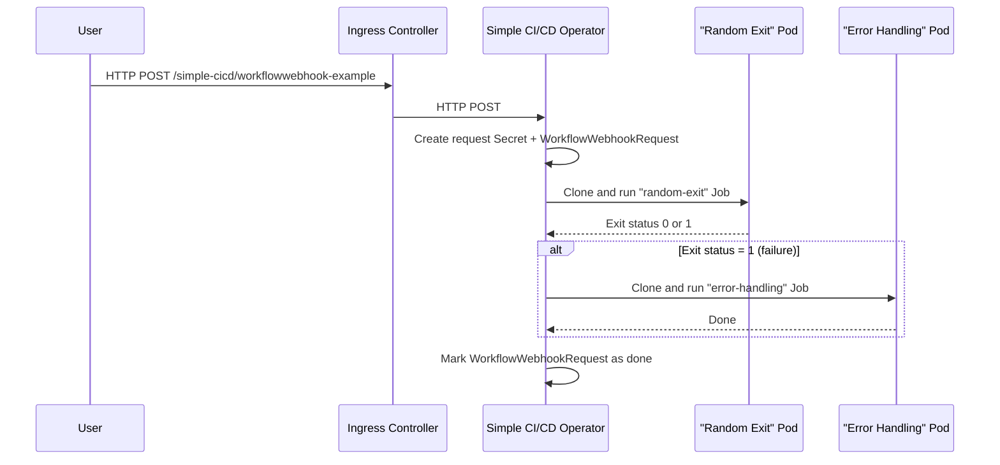

# Simple CI/CD


**Manage jobs, workflows, and webhooks natively via K8s APIs.**

No dependencies, no virtual machines, no Docker-in-Docker, no need to learn a
new language or framework.

---

## Getting Started

### Install via Helm (recommended)

```sh
helm upgrade --install \
  --create-namespace \
  --namespace simple-cicd \
  --repo https://jlsalvador.github.io/simple-cicd \
  operator operator
```

### Install via manifest

```sh
kubectl apply -f https://github.com/jlsalvador/simple-cicd/releases/latest/download/operator.yaml
```

---

## How It Works

Simple CI/CD follows the Kubernetes [Operator pattern].

The operator exposes an HTTP server on port `9000`. Each incoming request to
`/{namespace}/{workflowWebhookName}` creates a `WorkflowWebhookRequest` and
starts the reconciliation loop.


```mermaid
flowchart TD
    A["HTTP POST /{namespace}/{webhookName}"]
    A --> C[Request Secret]
    A --> B[WorkflowWebhookRequest]

    B -->|reads| D[WorkflowWebhook]
    D --> E[Workflow]
    E -->|clone| F[Jobs]
    C -->|mounted into every Job pod| F

    F --> G{watch Job status}

    G -->|success| H["next Workflow(s)<br>when: OnSuccess / Always"]
    G -->|failure| I["next Workflow(s)<br>when: OnFailure / Always"]

    H --> J{more Workflows?}
    I --> J
    J -->|no| K([WorkflowWebhookRequest done])
    J -->|yes| E
```

### Reconciliation loop

1. A webhook HTTP request arrives → the operator creates a
   `WorkflowWebhookRequest` (WWR) and a `Secret` containing the request data.
2. The reconciler reads the WWR, resolves the referenced `WorkflowWebhook` and
   its `Workflow` list.
3. For each active Workflow, referenced Jobs are cloned into the WWR namespace
   with the request Secret mounted.
4. The reconciler polls cloned Jobs until all finish, then evaluates `when`
   conditions to determine which next Workflows to trigger.
5. Steps 3-4 repeat until no further Workflows remain, at which point the WWR
   is marked `done: true`.

### Sequence diagram


```mermaid
sequenceDiagram
  participant User
  participant Ingress as Ingress Controller
  participant Operator as Simple CI/CD Operator
  participant Pod1 as "Random Exit" Pod
  participant Pod2 as "Error Handling" Pod

  User->>Ingress: HTTP POST /simple-cicd/workflowwebhook-example
  Ingress->>Operator: HTTP POST
  Operator->>Operator: Create request Secret + WorkflowWebhookRequest
  Operator->>Pod1: Clone and run "random-exit" Job
  Pod1-->>Operator: Exit status 0 or 1

  alt Exit status = 1 (failure)
    Operator->>Pod2: Clone and run "error-handling" Job
    Pod2-->>Operator: Done
  end

  Operator->>Operator: Mark WorkflowWebhookRequest as done
```

---

## Custom Resources

### Workflow

Defines which Jobs to clone and which Workflows to trigger next based on exit
status.

```yaml
apiVersion: simple-cicd.jlsalvador.online/v1alpha2
kind: Workflow
metadata:
  name: my-workflow
  namespace: example
spec:
  jobsToBeCloned:
    - name: my-job
      namespace: example # The same as the Workflow's namespace by default.
  next:
    - name: my-next-workflow
      when: OnAnyFailure # OnSuccess | OnAnySuccess | OnFailure | OnAnyFailure | Always
  suspend: false # Set to true to skip execution without deleting.
```

### WorkflowWebhook

Binds an HTTP path to one or more Workflows and controls concurrency.

```yaml
apiVersion: simple-cicd.jlsalvador.online/v1alpha2
kind: WorkflowWebhook
metadata:
  name: my-webhook
  namespace: example
spec:
  workflows:
    - name: my-workflow
      namespace: example # The same as the WorkflowWebhook's namespace by default.
  concurrencyPolicy: Allow # Allow | Forbid | Replace
  suspend: false
```

#### Concurrency policies

| Policy    | Behaviour                                         |
| --------- | ------------------------------------------------- |
| `Allow`   | Multiple WWRs can run simultaneously (default)    |
| `Forbid`  | Rejects new requests while a WWR is still running |
| `Replace` | Deletes any running WWR and starts a fresh one    |

#### `when` conditions

| Value          | Trigger condition                        |
| -------------- | ---------------------------------------- |
| `OnSuccess`    | All Jobs in the step succeeded (default) |
| `OnAnySuccess` | At least one Job succeeded               |
| `OnFailure`    | All Jobs in the step failed              |
| `OnAnyFailure` | At least one Job failed                  |
| `Always`       | Always trigger regardless of outcome     |

### WorkflowWebhookRequest

Created automatically by the operator on each incoming HTTP request. Tracks the
full execution lifecycle.

```sh
kubectl get wwr -n example

NAME                            DONE   WEBHOOK                   SUCCESSFUL JOBS   FAILED JOBS   AGE
workflowwebhook-example-b5lmh   true   workflowwebhook-example   1                 0             76s
workflowwebhook-example-lw2ws   true   workflowwebhook-example   1                 1             12m
```

---

## Request Data in Jobs

Every Job cloned by the operator has the original HTTP request data mounted as
read-only files at `/var/run/secrets/kubernetes.io/request/` inside all its
containers:

| File         | Content                                        |
| ------------ | ---------------------------------------------- |
| `body`       | Request body                                   |
| `headers`    | All headers serialised as JSON                 |
| `host`       | Host header value                              |
| `method`     | HTTP method (`GET`, `POST`, …)                 |
| `url`        | Full request URL                               |
| `remoteAddr` | Client IP and port (e.g. `10.0.0.5:54321`)     |
| `timestamp`  | Time the request was received (UNIX timestamp) |
| `userAgent`  | User-Agent header value                        |

---

## Example

This example creates a workflow that runs a job, echoing the original HTTP
request and returning a random exit code. On failure, it triggers a second
workflow that echoes "ERROR".

```yaml
# Job that randomly exits with code 0 or 1.
apiVersion: batch/v1
kind: Job
metadata:
  name: job-example-random-exit
  namespace: example
spec:
  suspend: true # Prevents Kubernetes from running this directly.
  backoffLimit: 0
  template:
    spec:
      containers:
        - name: random-exit
          image: bash
          command: ["sh", "-c", "exit $$(($RANDOM % 2))"]
        - name: echo-request
          image: bash
          command:
            - sh
            - -c
            - |
              echo "Host:      $(cat /var/run/secrets/kubernetes.io/request/host)"
              echo "Headers:   $(cat /var/run/secrets/kubernetes.io/request/headers)"
              echo "Method:    $(cat /var/run/secrets/kubernetes.io/request/method)"
              echo "URL:       $(cat /var/run/secrets/kubernetes.io/request/url)"
              echo "From:      $(cat /var/run/secrets/kubernetes.io/request/remoteAddr)"
              echo "At:        $(cat /var/run/secrets/kubernetes.io/request/timestamp)"
              echo "UserAgent: $(cat /var/run/secrets/kubernetes.io/request/userAgent)"
              echo "Body:      $(cat /var/run/secrets/kubernetes.io/request/body)"
      restartPolicy: Never # Do not re-run the pod if something fails.
---
# Job that echoes "ERROR".
apiVersion: batch/v1
kind: Job
metadata:
  name: job-example-error
  namespace: example
spec:
  suspend: true
  template:
    spec:
      containers:
        - name: error
          image: bash
          command: ["echo", "ERROR"]
---
# Workflow triggered on failure: runs job-example-error.
apiVersion: simple-cicd.jlsalvador.online/v1alpha2
kind: Workflow
metadata:
  name: workflow-example-on-failure
  namespace: example
spec:
  jobsToBeCloned:
    - name: job-example-error
---
# Main workflow: runs job-example-random-exit, then workflow-example-on-failure on any failure.
apiVersion: simple-cicd.jlsalvador.online/v1alpha2
kind: Workflow
metadata:
  name: workflow-example
  namespace: example
spec:
  jobsToBeCloned:
    - name: job-example-random-exit
  next:
    - name: workflow-example-on-failure
      when: OnAnyFailure
---
# WorkflowWebhook: listens on /example/workflowwebhook-example.
apiVersion: simple-cicd.jlsalvador.online/v1alpha2
kind: WorkflowWebhook
metadata:
  name: workflowwebhook-example
  namespace: example
spec:
  workflows:
    - name: workflow-example
```

In this example, we are going to trigger our WorkflowWebhook requesting it
through `kubectl port-forward`.

```sh
kubectl -n simple-cicd port-forward svc/operator 9000:9000 &
curl -XPOST http://localhost:9000/example/workflowwebhook-example
```

You could also trigger the WorkflowWebhook directly requesting it to the
operator service, inside the cluster, or through LoadBalancer service.

The next example shows how to configure an Ingress for exposing the operator service
externally.

```yaml
# Secret for basic-auth for the Ingress.
apiVersion: v1
kind: Secret
metadata:
  name: basic-auth
  namespace: simple-cicd
type: Opaque
stringData:
  auth: |
    # user:pass
    user:$apr1$j.P.ucaS$hHtkMN19glS9.ffLns2Eh/
---
# Ingress to expose the operator service externally.
apiVersion: networking.k8s.io/v1
kind: Ingress
metadata:
  name: ingress
  namespace: simple-cicd
  annotations:
    nginx.ingress.kubernetes.io/auth-type: basic
    nginx.ingress.kubernetes.io/auth-secret: basic-auth
spec:
  ingressClassName: nginx
  rules:
    - host: example.org
      http:
        paths:
          - path: /example/workflowwebhook-example
            pathType: Prefix
            backend:
              service:
                name: simple-cicd
                port:
                  number: 9000
```

Trigger the example WorkflowWebhook:

```sh
# From outside the cluster
curl -u user:pass -XPOST http://example.org/example/workflowwebhook-example

# From inside the cluster
curl -XPOST http://operator.simple-cicd:9000/example/workflowwebhook-example
```

---

## Motivation

Existing solutions either impose excessive requirements or require virtual
machines, Docker-in-Docker, or components outside the Kubernetes ecosystem.

Simple CI/CD uses native Kubernetes Jobs, so you do not need to learn a new
language.

<!-- markdownlint-disable MD033 -->
<table>
  <caption>Disclaimer: based on personal opinion. Please do your own research.</caption>
  <thead>
    <tr>
      <th>Alternative</th>
      <th>Advantages</th>
      <th>Disadvantages</th>
    </tr>
  </thead>
  <tbody>
    <tr>
      <td><a href="https://github.com/features/actions">GitHub Actions</a></td>
      <td><ul>
        <li>De-facto standard for public repositories on GitHub.</li>
      </ul></td>
      <td><ul>
        <li>Controlled by Microsoft.</li>
        <li>Closed garden.</li>
        <li>Actions must be published publicly.</li>
        <li>Limited by a paywall.</li>
        <li>Not suitable for air-gap environments or private clusters.</li>
      </ul></td>
    </tr>
    <tr>
      <td><a href="https://www.jenkins.io">Jenkins</a></td>
      <td><ul>
        <li>Open-source.</li>
        <li>Mature and battle-tested.</li>
        <li>Backed by a broad community.</li>
      </ul></td>
      <td><ul>
        <li>Resource hungry.</li>
        <li>Requires Groovy for advanced pipelines.</li>
        <li>Needs add-ons for Kubernetes integration.</li>
        <li>Limited CLI support.</li>
      </ul></td>
    </tr>
    <tr>
      <td><a href="https://tekton.dev">Tekton</a></td>
      <td><ul>
        <li>Open-source.</li>
        <li>Backed by the <a href="https://cd.foundation">CD Foundation</a>.</li>
      </ul></td>
      <td><ul>
        <li>Cannot use more than one PersistentVolume per Pod.</li>
        <li>Frequent API churn leading to deprecated Catalog tasks.</li>
      </ul></td>
    </tr>
    <tr>
      <td><a href="https://drone.io">Drone</a></td>
      <td><ul>
        <li>Open-source.</li>
      </ul></td>
      <td><ul>
        <li>Controlled by <a href="https://www.harness.io">Harness</a>.</li>
        <li>Community pull requests receive limited attention.</li>
      </ul></td>
    </tr>
    <tr>
      <td><a href="https://woodpecker-ci.org">Woodpecker CI</a></td>
      <td><ul>
        <li>Open-source community fork of Drone.</li>
        <li>Community supported.</li>
      </ul></td>
      <td><ul>
        <li>No namespaced PersistentVolume support across tasks.</li>
        <li>Limited Kubernetes support.</li>
      </ul></td>
    </tr>
    <tr>
      <td><a href="https://gitea.com/gitea/act_runner">Gitea act_runner</a></td>
      <td><ul>
        <li>Community effort for on-premise GitHub Actions compatibility.</li>
      </ul></td>
      <td><ul>
        <li>Requires a VM-like environment, as GitHub Actions does.</li>
        <li>No native Kubernetes integration.</li>
      </ul></td>
    </tr>
    <tr>
      <td><a href="https://github.com/jlsalvador/simple-cicd">Simple CI/CD</a></td>
      <td><ul>
        <li>Open-source.</li>
        <li>Kubernetes-native operator.</li>
        <li>Platform agnostic (cloud, on-premise, hybrid, air-gap).</li>
        <li>No external dependencies.</li>
        <li>Low resource usage (~8 MB RAM).</li>
      </ul></td>
      <td><ul>
        <li>Experimental; not yet battle-tested in production.</li>
        <li>Maintained by a single individual.</li>
        <li>No web UI (yet).</li>
      </ul></td>
    </tr>
  </tbody>
</table>
<!-- markdownlint-enable MD033 -->

---

## License

Copyright 2023 José Luis Salvador Rufo <salvador.joseluis@gmail.com>.

Licensed under the Apache License, Version 2.0 (the "License");
you may not use this file except in compliance with the License.
You may obtain a copy of the License at

<http://www.apache.org/licenses/LICENSE-2.0>

Unless required by applicable law or agreed to in writing, software
distributed under the License is distributed on an "AS IS" BASIS,
WITHOUT WARRANTIES OR CONDITIONS OF ANY KIND, either express or implied.
See the License for the specific language governing permissions and
limitations under the License.

[Operator pattern]: https://kubernetes.io/docs/concepts/extend-kubernetes/operator/
